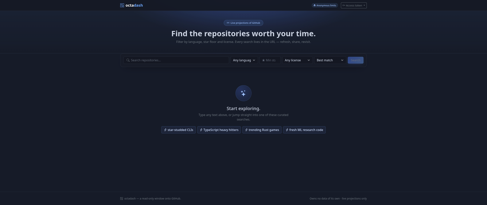

<div align="center">

# octadash

**A read-only window onto GitHub — search repositories and inspect them at a glance.**

[](https://angular.dev)
[](https://www.typescriptlang.org)
[](https://pnpm.io)
[](https://getbootstrap.com)
[](https://www.chartjs.org)
[](LICENSE)

*No backend. No database. Live projections of `api.github.com` straight from your browser.*

[Features](#features) • [Screenshots](#screenshots) • [Quick start](#quick-start) • [Usage](#usage) • [Tech stack](#tech-stack) • [Project structure](#project-structure)

</div>

---

## Overview

**octadash** is a fast, client-side dashboard for GitHub discovery. Search repositories by text, language, star floor and license, then open any result as a deep dashboard with language breakdown, yearly commit activity, contributor leaderboard and release info.

Every search lives in the URL — refresh, share, revisit. All requests go directly to the GitHub REST API; octadash owns no data.

> [!NOTE]
> octadash is **read-only** and **stateless**. It stores only an optional personal access token in `localStorage` (`octadash.github-token`) and never sends it anywhere except `api.github.com`.

> [!TIP]
> Anonymous GitHub limits are ~60 core requests/hour and ~10 searches/minute. Add a PAT in the top bar to raise all scopes to **5,000/hour**.

---

## Screenshots

### Search



Hero search with language, stars, license and sort controls.

### Results


Repository cards with infinite scroll.

### Dashboard


Repository dashboard with snapshot, commit chart, languages doughnut and contributor leaderboard.

---

## Features

- **Powerful search** — free text + language (23 presets), minimum stars, license (12 presets), sort `best | stars | forks | updated`. Qualifiers are compiled to GitHub search syntax (`language:`, `stars:>=`, `license:`) and synced to query params.
- **Infinite feed** — 30 repos per page, `IntersectionObserver` prefetch (`700px` margin), id-deduped, skeleton loaders, end-of-feed marker, cached scroll position.
- **Instant share** — `?q=&lang=&stars=&license=&sort=` is the source of truth; canonical key dedupes redundant navigation.
- **Repo dashboard** — header with avatar/topics/homepage, 6-stat snapshot (stars, watchers, forks, issues, license, latest release), 4 widgets loaded in parallel:
  - *Languages* — doughnut by bytes (colors per language, `<1%` → Other, up to 12 slices)
  - *Commit activity* — bar chart of 52 weeks (`/stats/commit_activity`, retries 4× until GitHub finishes `202`)
  - *Contributors* — top 10 leaderboard with proportional bars
  - *About* — created/pushed/size/license name
- **Rate-limit aware** — separates `core` vs `search` scopes, reads `x-ratelimit-*` headers, shows countdown (`m:ss`), ETag/304 caching, and `forceBlock` fallback when GitHub omits headers.
- **Token-friendly** — optional PAT via `Access token` dropdown; header badge toggles `Anonymous limits` ↔ `Token active`.
- **Resilient UX** — dedicated screens for `quota`, `offline`, `not-found`, `invalid` (`/repo/owner/name` validation), `generic`.

---

## Tech Stack

| Category | Technology | Notes |
| --- | --- | --- |
| Framework | Angular 22 (standalone, signals, `OnPush`, `provideRouter`, `provideHttpClient(withFetch())`) | |
| Language | TypeScript 6.0 (`ES2022`, `preserve` modules, strict) | |
| Package manager | pnpm 11.22 | `pnpm-workspace.yaml` |
| UI | Bootstrap 5.3 + Bootstrap Icons + ng-bootstrap 21 | Dark theme (`data-bs-theme="dark"`, `src/styles.css`) |
| Charts | Chart.js 4.5 + ng2-charts 10 | `provideCharts(withDefaultRegisterables())` |
| API | GitHub REST (`api.github.com`, `X-GitHub-Api-Version: 2022-11-28`) | No proxy |
| Tooling | Angular CLI 22, Prettier 3.8, Nix flake (`nix-capsule`) | |
| Runtime | Browser-only | No Node server |

---

## Quick Start

### Prerequisites

- Node.js ≥ 20
- pnpm 11.22 (`npm i -g pnpm` or via Corepack)


### Installation

```bash
git clone https://gitlab.com/codnixus/octadash
cd octadash
pnpm install
```

### Run

```bash
pnpm start          # ng serve → http://localhost:4200
```

### Build

```bash
pnpm build          # production → dist/
pnpm run watch      # development watch build
```

> [!IMPORTANT]
> No environment variables are required. The app talks directly to `https://api.github.com`. For local development behind a corporate proxy, ensure `api.github.com` is reachable.

---

## Configuration

### GitHub personal access token (optional but recommended)

1. Create a token at [github.com/settings/tokens](https://github.com/settings/tokens) — classic `ghp_…` or fine-grained `github_pat_…`. No scopes required for public data; `public_repo` is enough.
2. In octadash, click **Access token** in the top bar, paste the token, click **Save**.
3. The badge in the navbar switches to `Token active`. Click **Clear** to remove it.

Token is stored only in `localStorage` under `octadash.github-token` (`src/app/core/token-store.ts:3`) and attached as `Authorization: Bearer <token>`.

> [!WARNING]
> Anonymous limits reset per IP/hour. If you see `Quota resets in 2:34` and a disabled retry button, wait or add a token — octadash cannot lift GitHub's limits itself.

---

## Usage

### Search — `/`

```
GET /?q=cli&lang=TypeScript&stars=5000&license=mit&sort=stars
```

- **Text** `q` — any GitHub search term (`machine learning`, `cli`, `game`).
- **Language** — e.g. `TypeScript`, `Rust`, `Python` (23 options).
- **Min stars** — numeric floor (`stars:>=5000`).
- **License** — `mit`, `apache-2.0`, `gpl-3.0`, … (12 options).
- **Sort** — `best` (default), `stars`, `forks`, `updated`.

Quick-start chips (`star-studded CLIs`, `TypeScript heavy hitters`, etc.) and topic buttons (`#topic`) jump directly to prefilled searches. Results are paginated; scroll near the bottom to auto-load the next page.

### Dashboard — `/repo/:owner/:name`

```
/repo/angular/angular
/repo/sinedied/smoke
```

Validates `owner`/`name` against `[^a-z0-9_.-]/i`. Shows the header, snapshot row, and 4 widgets. Each widget shows `busy → ready` or `failed` independently — one failing does not block the rest. Topics are links back to search (`?q=topic`).

---

## How It Works

```
Browser (Angular signals + Router)
  └─ GitHubClient (HttpClient + fetch, ETag cache, If-None-Match/304)
       └─ https://api.github.com
            ├─ GET /search/repositories?q=&sort=&order=desc&per_page=30&page=
            ├─ GET /repos/:owner/:name
            ├─ GET /repos/:owner/:name/languages
            ├─ GET /repos/:owner/:name/contributors?per_page=10
            ├─ GET /repos/:owner/:name/releases/latest  (404 → null)
            └─ GET /repos/:owner/:name/stats/commit_activity (202 → retry)
```

- **Caching:** in-memory `Map<string, {etag, body}>` per request key.
- **Errors:** `NotFound (404)`, `Offline (status 0)`, `QuotaExceeded (429 / 403+remaining=0)`, generic `RequestFailure`.
- **Rate limits:** `RateLimits` (`src/app/core/rate-limits.ts`) records `x-ratelimit-remaining/limit/reset` per scope and exposes `isBlocked()`/`secondsLeft()`.
- **Formatting:** `Intl.NumberFormat` compact, byte units, `timeAgo`/`shortDate`, language colors (`src/app/core/format.ts`).

---

## Project Structure

```
src/
├── index.html                  # dark theme, meta description
├── main.ts                     # bootstrapApplication(App, appConfig)
├── styles.css                  # CSS vars --surface/--line, gradients, scrollbars
└── app/
    ├── app.ts / app.html / app.css   # navbar (token badge + PAT dropdown), footer
    ├── app.routes.ts                 # '' → SearchPage, 'repo/:owner/:name' → RepoDashboardPage
    ├── app.config.ts                 # provideRouter, provideHttpClient(withFetch), provideCharts
    ├── core/
    │   ├── github-client.ts    # all GitHub REST calls + error mapping
    │   ├── token-store.ts      # signal + localStorage
    │   ├── rate-limits.ts      # core/search scope tracking
    │   ├── search-params.ts    # normalize/qualifiersFor/canonicalKey + LANGUAGES/LICENSES/SORTS
    │   ├── models.ts           # Repo, Contributor, CommitWeek, ReleaseInfo
    │   └── format.ts           # fmtCompact/fmtBytes/timeAgo/langColor
    ├── features/
    │   ├── search/             # search.page.{ts,html,css} + results-memory.ts
    │   └── repo/               # repo-dashboard.page.{ts,html,css}
    └── shared/
        ├── repo-card.ts        # card with topics, meta, lang dot
        ├── rate-limit-banner.ts
        ├── state-screen.ts     # quota/offline/not-found/invalid/generic
        └── widget-states.ts    # WidgetBusy / WidgetFailed
assets/
├── search.png
├── search_result.png
└── dashboard.png
```

---

## Troubleshooting

| Symptom | Cause | Fix |
| --- | --- | --- |
| `Out of search quota` / `Quota resets in …` | `search` or `core` `x-ratelimit-remaining=0` | Wait for reset or add a PAT |
| `GitHub is unreachable` | `api.github.com` network failure (`status 0`) | Check connection / proxy / `curl https://api.github.com` |
| `Repository not found` | `404` on `/repos/:owner/:name` | Verify spelling/casing, repo may be private |
| `That doesn't look like a repository URL` | `owner`/`name` fails `[^a-z0-9_.-]` check | Use `/repo/owner/name` exactly |
| `GitHub is still computing stats` | `/stats/commit_activity` returned `null` after 4× `202` retries | Wait a minute and reload |
| Language chart empty | No `languages` data | Expected for empty repos |

---

## Resources

- [GitHub REST API — Search repositories](https://docs.github.com/en/rest/search/search#search-repositories)
- [GitHub REST API — Get a repository](https://docs.github.com/en/rest/repos/repos#get-a-repository)
- [GitHub rate limiting](https://docs.github.com/en/rest/using-the-rest-api/rate-limits-for-the-rest-api)
- [Angular documentation](https://angular.dev)
- [Bootstrap 5 docs](https://getbootstrap.com/docs/5.3/getting-started/introduction/)
