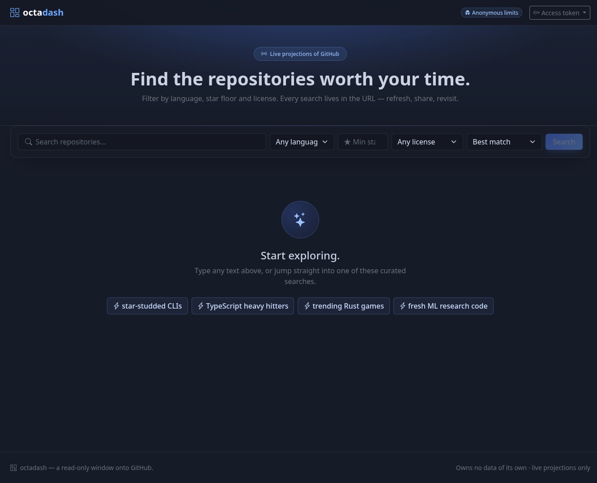
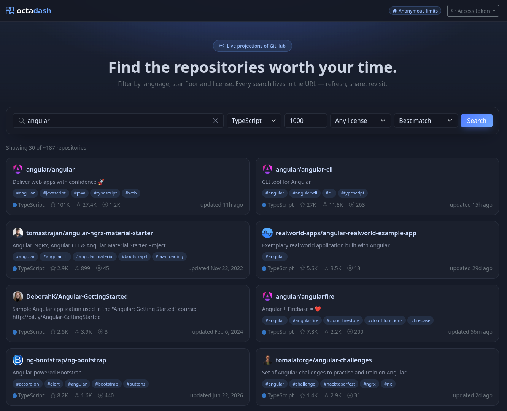
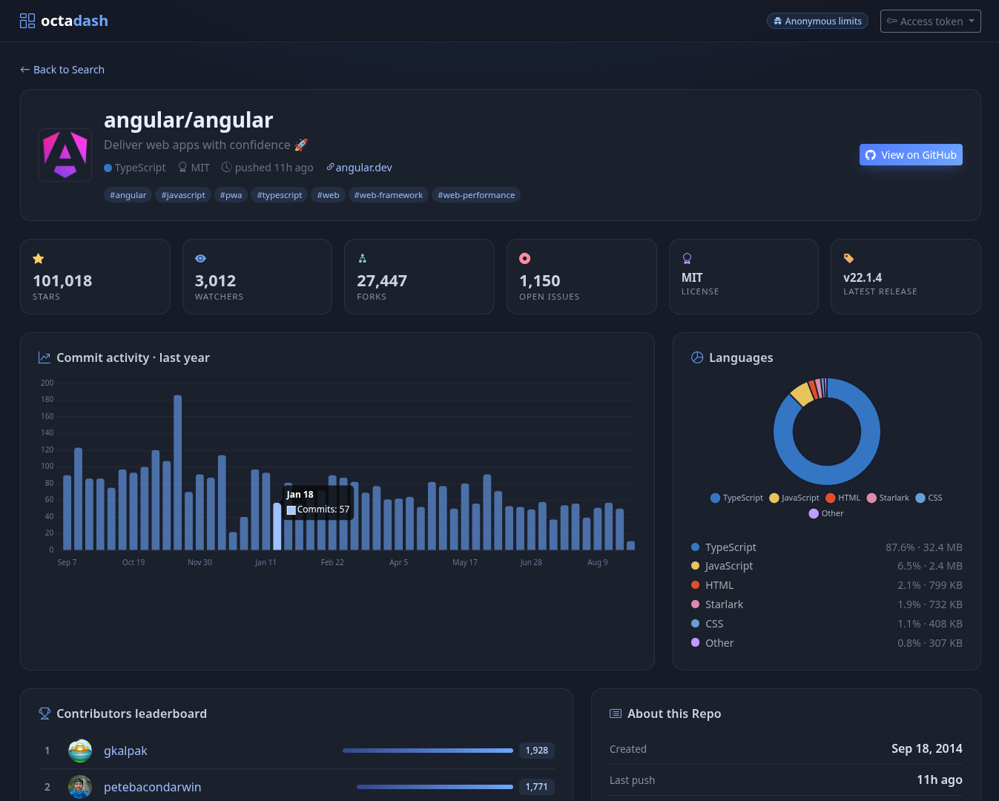
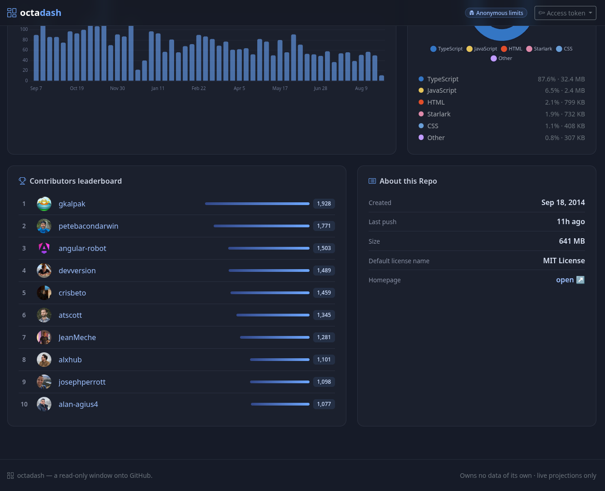
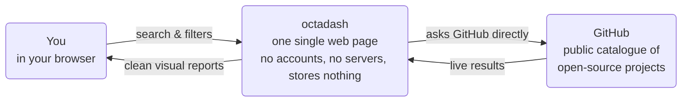

<!-- prettier-ignore -->
<div align="center">

# octadash

**Find the open-source projects worth your time.**

_A free window onto GitHub: search millions of open-source projects and get a clean, visual report on any of them._

[](LICENSE)
[](https://angular.dev)
[](https://www.typescriptlang.org)
[](https://getbootstrap.com)
[](https://www.chartjs.org)

[What can you do with it](#what-can-you-do-with-it) • [How it fits together](#how-it-fits-together) • [Good to know](#good-to-know) • [Try it yourself](#try-it-yourself)



</div>

**octadash** is a website for exploring open-source software — software that is free for anyone to use, study, and improve. It searches **GitHub**, the world's largest catalogue of such projects, and turns any project into a one-screen report: how popular it is, how active it has been lately, and who is behind it.

Think of it as a shop window: you can browse everything freely, but you cannot touch the shelves.

> [!NOTE]
> Nothing to install, no account, nothing to pay. octadash is **read-only**: it can look at GitHub, but it can never change anything. It keeps no records of its own — every visit shows live data straight from the source.

## What can you do with it?

### 1. Search for anything



Type what you are curious about — _games_, _weather_, _machine learning_ — then narrow the flood with three filters: programming language, minimum popularity, and usage permissions. No special syntax, no training needed.

### 2. Browse the results

Each result is a card with the project's picture, a one-line description, its topic tags, and quick counters: **stars** (likes), **forks** (copies people have made), and **open issues** (its public to-do list). Keep scrolling and more results appear on their own — and every search has its own web address, so you can share it or bookmark it.

### 3. Open a project's report card





Every project opens into a one-screen report card. At the top, the vital signs: popularity, followers, copies, workload, license, latest release. Below, the story: how busy the project has been each week for the past year, what it is built from, and who its most active builders are. One glance tells you whether a project is alive, healthy, and worth your time.

## How it fits together

octadash does one job and stays out of the way. Your browser opens one web page; that page asks GitHub for exactly what you searched and shows you the answer. There is no middleman and no memory.



> [!TIP]
> Planning to browse a lot? GitHub lets casual visitors make about 60 requests an hour. Add a free personal key from your own GitHub account — octadash calls it an _access token_ — and that jumps to 5,000. It lives only in your browser and is sent nowhere except github.com.

## Good to know

- **Free, with no sign-up** — open the site and start searching. No account, no setup, nothing to install.
- **Private by design** — octadash has no servers or databases of its own and stores nothing between visits. The optional access key never leaves your browser, except to talk to github.com.
- **Honest about limits** — when GitHub throttles browsing, octadash says so plainly and counts down to the reset, instead of failing silently.
- **Never a dead end** — lost connection, mistyped project name, empty results: you get a friendly screen and a way back, not a broken page.
- **Built to be shared** — every search and every project page has its own link, so you can send exactly what you see to a colleague.

## Try it yourself

octadash runs entirely in your browser; you only need an internet connection that reaches github.com.

<details>
<summary>Running it from the source code</summary>

You need [Node.js](https://nodejs.org) 20 or newer and [pnpm](https://pnpm.io) 11 or newer. Then:

```bash
git clone https://github.com/hexrustox/octadash
cd octadash
pnpm install
pnpm start
```

Open **http://localhost:4200** in your browser and start exploring.

</details>
